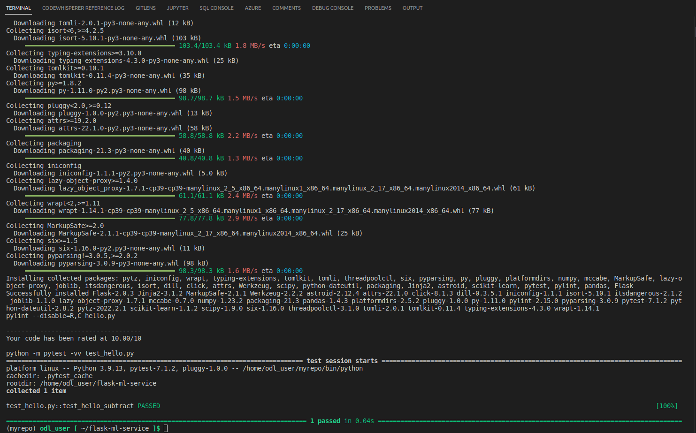
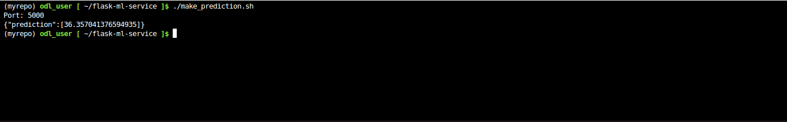
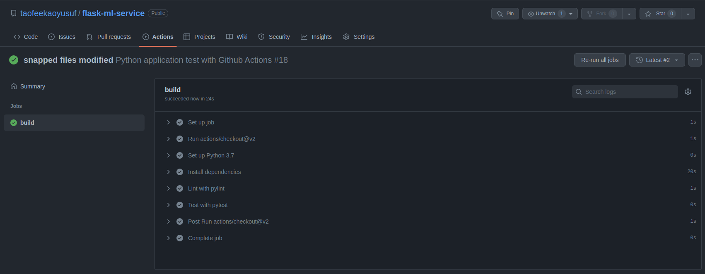

[](https://github.com/taofeekaoyusuf/flask-ml-service/actions/workflows/python-app.yml)

# Agile Development with Azure Project: Building a CI/CD Pipeline

## Overview
This project demonstrates the advantages of automating DevOps with CI/CD pipelines.
A Machine Learning web application is built, test, and deployed using Github Actions and Azure pipelines.

The [project plan](#project-plan) is followed by [instructions](#instructions) that detail the following steps:

   * [Cloning and testing locallcy](#cloning-and-testing-locally)

   * [Deploying to Azure App Services](#deploying-to-azure-app-services)

   * [Setting up CI/CD using Azure Pipelines](#setting-up-cicd-using-azure-pipelines)

Further improvements to the project are discussed in [enhancements](#enhancements).

A short [demo](#demo) concludes the documentation.

## Status

[](https://github.com/taofeekaoyusuf/flask-ml-service/actions/workflows/python-app.yml)

<!---
[](https://dev.azure.com/daimler-mic/ddpdev-azure-devops/_build/latest?definitionId=7205&branchName=main)
-->

## Project Plan

The [yearly project plan](https://docs.google.com/spreadsheets/d/1sBpBvsHc10Ye5TirvqN2-NznjpvUYs74U5Rk04GktDU/edit?pli=1#gid=1348135932) depicts that DevOps automation is one essential step in the context of the overall project planned for Q2.

The [quarterly project plan](https://docs.google.com/spreadsheets/d/1sBpBvsHc10Ye5TirvqN2-NznjpvUYs74U5Rk04GktDU/edit?pli=1#gid=1348135932) details the steps necessary for building the CI-CD pipeline and estimates the week by week deliverables as well as the effort associated to each deliverable in T-Shirt-Sizes (S,M,L).

The [Trello board](https://trello.com/b/Ey9sWsqr/ci-cd-pipeline-operational-procedure) is then used for task planning and tracking.


## Instructions

The overall architecture of this project is as follows:


The code resides in a GitHub repo together with test cases that can be used for quality assurance.

A manual code checkout allows for local integration and testing, see [Cloning and testing locally](#cloning-and-testing-locally).

Continuous Integration (CI) of the code is performed upon each commit via GitHub Actions, see [Setting up CI using Github Actions](#setting-up-ci-using-github-actions).

The code can be executed in the cloud as a webapp in Azure App Services, see [Deploying to Azure App Services](#deploying-to-azure-app-services).

Finally, the combination of Continuous integration and Continuous Delivery (CI/CD) via Azure Pipelines is used to automatically reflect all comitted changes in the running webapp, see [Setting up CI/CD using Azure Pipelines](#setting-up-cicd-using-azure-pipelines).

### Cloning and Testing Locally

Head to https://github.com and clone the repo https://github.com/taofeekaoyusuf/flask-ml-service.
The following instructions will use the original repo, you should replace them with your cloned repo.

Login to Azure and open the Azure cloud shell.

Clone this project from github and change to the project directory:
```bash
azureuser@Azure:~$ git clone https://github.com/taofeekaoyusuf/flask-ml-service.git
azureuser@Azure:~$ cd fflask-ml-service
```

Create a virtual environment and source it:
```bash
azureuser@Azure:~/flask-ml-service$ make setup
azureuser@Azure:~/flask-ml-service$ source ~/.flask-ml-service/bin/activate
```


Build locally using 'make all' which will install all dependencies, perform linting and testing:
```bash
azureuser@Azure:~/flask-ml-service$ make all
```




Run the application locally:
```bash
(.flask-ml-service) azureuser@Azure:~/flask-ml-service$ flask run
```


Test it locally in a new Azure cloud shell (as your first shell is blocked by 'flask run') :
```bash
azureuser@Azure:~$ source .flask-ml-service/bin/activate
(.flask-ml-service) azureuser@Azure:~$ cd flask-ml-service/
(.flask-ml-service) azureuser@Azure:~/flask-ml-service$ ./make_prediction.sh
```



Close the second cloud shell and stop flask by hitting CRTL-C in the first cloud shell.


### Setting up CI using Github Actions
If you directly jumped to this section: Clone the repo:
```bash
azureuser@Azure:~$ git clone git@github.com:taofeekaoyusuf/flask-ml-service.git
```

Setup a virtual environment and activate it:
```bash
azureuser@Azure:~/flask-ml-service$ make setup
azureuser@Azure:~/flask-ml-service$ source ~/.flask-ml-service/bin/activate
```

Ensure that all tests pass locally:
```bash
(.flask-ml-service) azureuser@Azure:~/flask-ml-service$ make all
```


Enable Github Actions by clicking on 'Actions', then click on "set up a workflow yourself' and use the GitHub Actions yaml file [.github/workflows/main.yml](.github/workflows/main.yml) as a template.

Once the workflow is created it is automatically triggered and should show a passing build:



### Deploying to Azure App Services
Install the app to Azure app services using the free tier:
```bash
(.flask-ml-service) azureuser@Azure:~/flask-ml-service$ az webapp up --name myflaskmlwebappy --resource-group Azuredevops --runtime "PYTHON:3.7"
```


Check if the app is up and running by opening the URL containing the webapp name provided in the previous step: https://myflaskmlwebappy.azurewebsites.net/


Edit file 'make_predict_azure_app.sh' and replace '< yourappname >' with your webapp name (e.g. flask-ml-service).

Test the remote webapp:
```bash
(.flask-ml-service) azureuser@Azure:~/flask-ml-service$ ./make_predict_azure_app.sh
```


Logs of your running webapp can be accessed in two ways:

A. Via the public endpoint by appending '/api/logs/docker': https://myflaskmlwebappy.scm.azurewebsites.net/api/logs/docker

B. Via your cloud shell as a stream:
```bash
(.flask-ml-service) azureuser@Azure:~/flask-ml-service$ az webapp log tail
```


Performance validation of the webapp can be performed via a load test using [locust](https://locust.io). \
Replace '< yourappname >' in the provided configuration and call locust:
```bash
(.flask-ml-service) azureuser@Azure:~/flask-ml-service$ nano locustfile.py
(.flask-ml-service) azureuser@Azure:~/flask-ml-service$ locust -f locustfile.py --headless -u 20 -r 5 -t 20s
```
Using the parameters above locust will use 20 users with a spawn rate of 5 users per second and run for 20 seconds:


### Setting up CI/CD using Azure Pipelines
At the time of writing the following steps were sufficient to setup a pipeline.
As things change quite fast in a cloud environment please consult the [official documentation provided by Microsoft](https://docs.microsoft.com/en-us/azure/devops/pipelines/ecosystems/python-webapp?view=azure-devops) in case of unclarities.

Open Azure devops in a browser https://dev.azure.com.

Create a new project or selecting an existing project.

Head to Pipelines and click on 'New pipeline'.

When you are asked 'Where is your code?' select Github and choose your cloned repo.

Configure your pipeline as a "Python to Linux Web App on Azure", select your subscription and the webapp name you used to deploy the webapp earlier (e.g. flask-ml-service).
Click on 'Validate and configure'.


Under 'Pipelines' you should now see a first successfull run of the pipeline including the 'Build stage' and the 'Deploy Web App' stage:


Coming back to the Pipeline page, we will observe successful build and deployment:


From now on every change to your code will trigger the CI/CD pipeline and update your webapp accordingly:

Change the application name in app.py from 'Sklearn Prediction Home' to 'Sklearn Prediction Home via Azure CI/CD Pipeline' and commit it:
```bash
(.flask-ml-service) azureuser@Azure:~/flask-ml-service$ nano app.py
(.flask-ml-service) azureuser@Azure:~/flask-ml-service$ git add app.py
(.flask-ml-service) azureuser@Azure:~/flask-ml-service$ git commit -m "Changed application name"
(.flask-ml-service) azureuser@Azure:~/flask-ml-service$ git push
```


The pipeline is triggered by the commit:


After the pipeline run completed successfully the changed application name is visible:


## Enhancements
Future improvements include but are not limited to:
* Additional testing using pytest: Testcases could be added that are automatically checked by a Makefile target.
* Code coverage using pytest-cov: In addition to testing code coverage could be checked in an automated way via a Makefile target.
* Automation of the load testing using locust: While the instructions in the [Deploying to Azure App Services](#deploying-to-azure-app-services) section depict the initial use of locust for load testing it could be included as an additional target in the Makefile.


## Demo

A short demo demonstrates the main steps of the project:
[Demo Video](../../raw/main/demo/demo.mp4)

The demo covers the following steps:
> Welcome to the demo of our agile development project.
> We built a machine learning application and automated testing and provisioning by continuous integration and continuous deployment using pipelines.
>
> As shown in the project architecture the source code is maintained in Github.
> The project can be manually checked out in cloud shell and tested by calling 'make all'.
>
> GitHub Actions are used for Continuous Integration to check the project build status upon every commit.
>
> Azure Pipelines are used for Continuous Integration and Continuous Deployment of our machine learning application to App Services.
> The application can be accessed via a public endpoint.
> The logs are accessible via that endpoint or can be streamed in the cloud shell.
> The main functionality of the application is exposed via an API and can be accessed from the cloud shell.